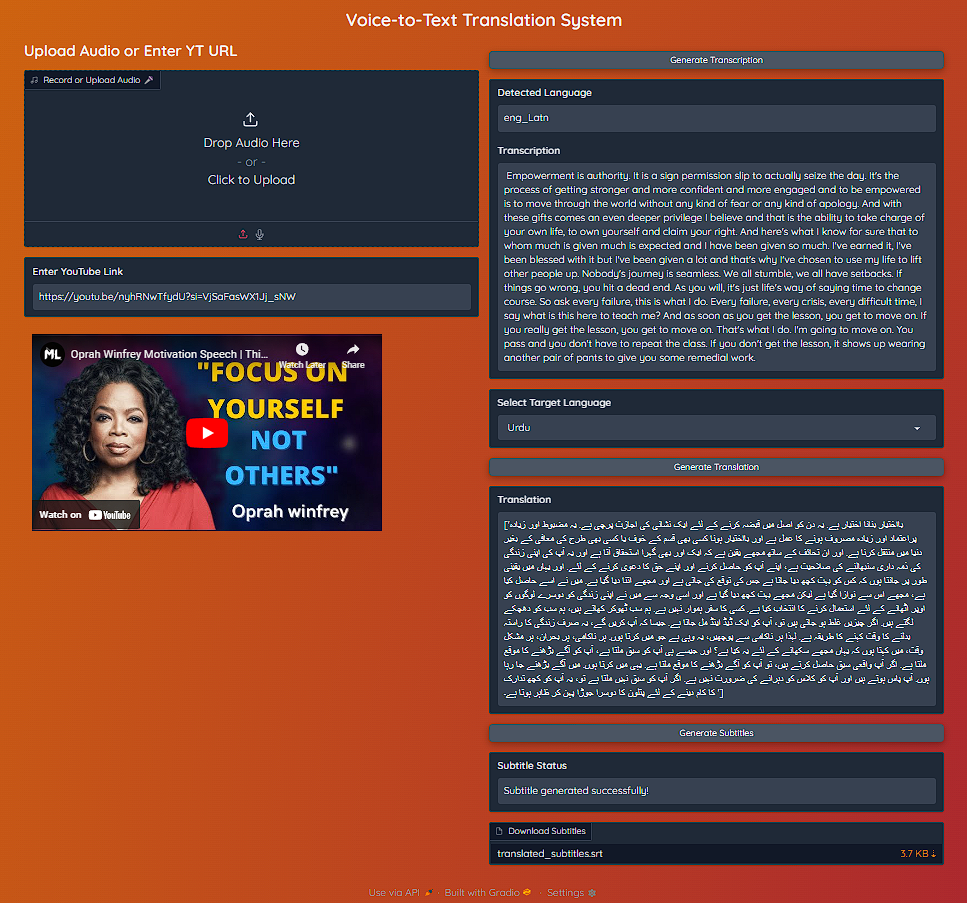

# Voice-to-Text-Translation-System-Leveraging-Whisper-and-IndicTrans2.

# DEMO
<div style="display: flex; justify-content: center; align-items: center; height: 100vh;">
  
</div>

## Getting Started Run the following commands:

```bash
  #Clone the repo:
  !git clone https://github.com/injilashah/Voice-to-Text-Translation-System-Leveraging-Whisper-and-IndicTrans2.git

  #Move to the directory path
  %cd /content/Voice-to-Text-Translation-System-Leveraging-Whisper-and-IndicTrans2

  # Install Dependencies
  !chmod +x install.sh
  !./install.sh

  #Move to root directory  
  %cd /content/Voice-to-Text-Translation-System-Leveraging-Whisper-and-IndicTrans2

  #Run the Applicaiton
  python run app.py
```

